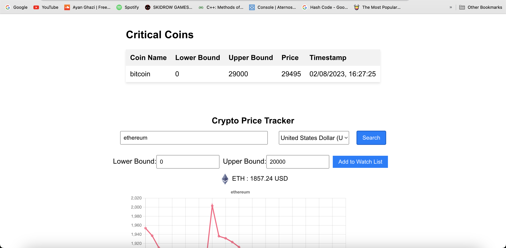
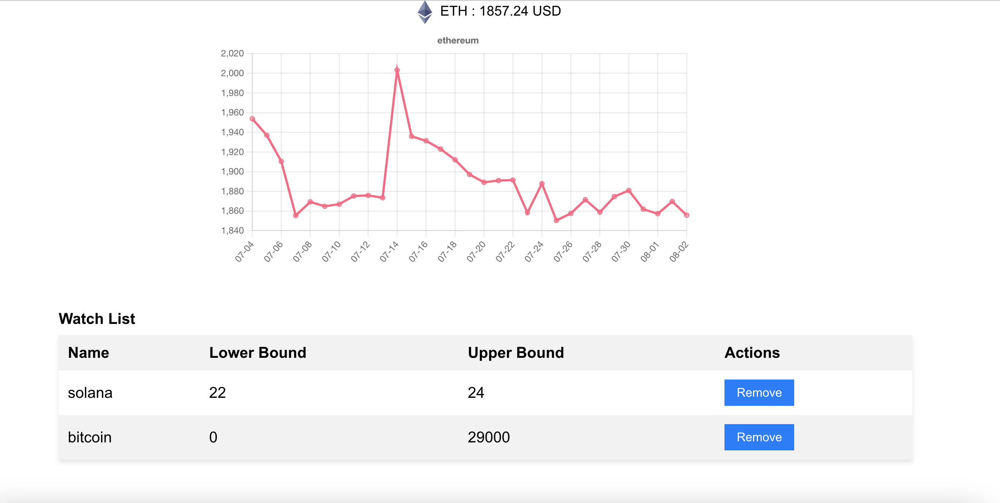

# Crpto Tracker with Coin Gecko API

The project is made using ReactJs for frontend, Express and NodeJs run the backend, for APIs we have used CoinGecko and firebase. We have used firebase real time database as our backedn NoSQL database.

## Live Website

the live website is hosted on https://cryptotracker-jimq.onrender.com/
and the backend is hosted on https://crypto-tracker-backend-q6h1.onrender.com
give it some time as free web services scale down when not in use.

give it a try eventhough it may not work because the backend hosted on render does not work due to the restrictions of Coin Gecko API as it only allows 30 requests per minutes from an IP and we possibly use a shared IP on the public server.

## Deployment

To deploy this project

Build the Docker images:

Go to the root folder of the project (crypto-tracker) in the terminal/command prompt.
Run the following commands:
```bash
  docker build -t frontend-image .
  docker build -t backend-image ./backend
```

Run the Docker Containers using
```bash
  docker-compose up
```
Your React app will start on http://localhost:3000

## Images


